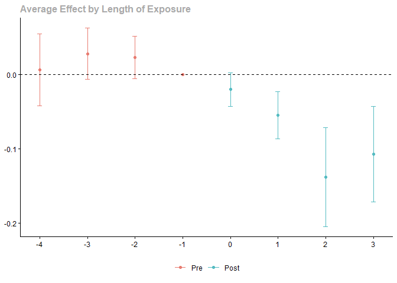
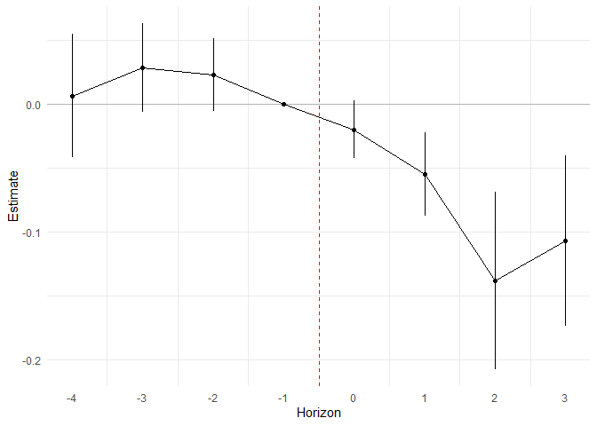
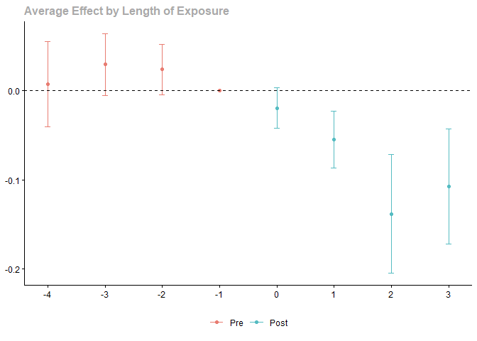
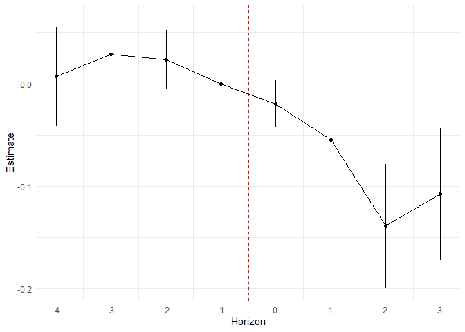
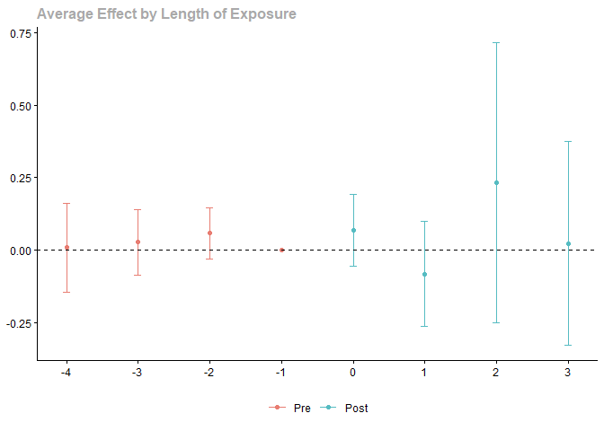
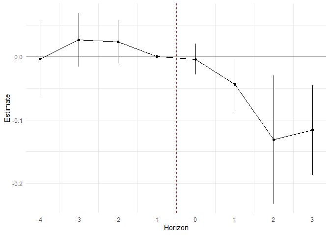

Comparing `lpdidcsa` and `did` Packages for Difference-in-Differences
Estimation
================
Olivier Godechot
2026-04-09

# Introduction

This vignette shows how to use the `lpdidcsa` package for
difference-in-differences (DiD) estimation and compares its results with
those from the `did` package by Callaway and Sant’Anna. We focus on two
estimation methods: inverse probability weighting (IPW) and adjusted
regression. Additionally, we explore how `lpdidcsa` handles missing
observations, showcasing its partial rebalancing approach.

# Setup

First, load the required packages and set the working directory.

``` r
library(data.table)
library(did)
library(lpdidcsa)
setwd(dirname(rstudioapi::getActiveDocumentContext()$path))
```

# Data Preparation

We use the `mpdta_r` dataset from the `lpdidcsa` package for our
analysis.

``` r
data(mpdta_r, package = "lpdidcsa")

mpdta_w  <- lpdidcsa_data(mpdta_r, unit = "countyreal", time = "year",
                     dependent = "lemp", treat = "treat")
```

# Comparison of Estimation Methods

## Inverse Probability Weighting (IPW)

### Using `did` Package

``` r
csa_ipw_det <- att_gt(
  yname = "lemp",
  tname = "year",
  idname = "countyreal",
  gname = "first.treat",
  base_period = "universal",
  control_group = c("notyettreated"),
  est_method = "ipw",
  bstrap = FALSE,
  cband = FALSE,
  xformla = ~lpop,
  data = mpdta_r
)
# summary(csa_ipw_det)
csa_ipw <- aggte(csa_ipw_det, type = "dynamic")
# summary(csa_ipw)
ggdid(csa_ipw)
```

<!-- -->

### Using `lpdidcsa` Package

To obtain equivalent results to those of the `did` package, we interact
covariates with time dummy variables.

``` r
lpdidcsa_ipw <- lpdidcsa(
  data = mpdta_w,
  meth = "lpdid_ipw",
  dtreat = "dtreat",
  time = "year",
  unit = "countyreal",
  dependent = "lemp",
  controls = "lpop*i(year)"
)
lpdidcsa_ipw$plot
```

<!-- -->

### Comparison of Results

``` r
cbind(
  csa_ipw$att.egt[csa_ipw$att.egt != 0],
  csa_ipw$se.egt[csa_ipw$att.egt != 0]
) - lpdidcsa_ipw$est[lpdidcsa_ipw$est$estimate != 0, c("estimate", "se")]
```

    ##         estimate            se
    ##            <num>         <num>
    ## 1: -4.857226e-17 -6.206613e-05
    ## 2:  5.374173e-15 -4.572944e-05
    ## 3: -2.383510e-14 -5.109795e-05
    ## 4: -7.519679e-14  1.098355e-04
    ## 5:  4.996004e-16 -2.324747e-04
    ## 6:  4.976242e-12 -1.123873e-03
    ## 7: -6.938894e-17 -1.158002e-03

## Adjusted Regression

### Using `did` Package

``` r
csa_adj_det <- att_gt(
  yname = "lemp",
  tname = "year",
  idname = "countyreal",
  gname = "first.treat",
  base_period = "universal",
  control_group = c("notyettreated"),
  est_method = "reg",
  bstrap = FALSE,
  cband = FALSE,
  xformla = ~lpop,
  data = mpdta
)
# summary(csa_adj_det)
csa_adj <- aggte(csa_adj_det, type = "dynamic")
# summary(csa_adj)
ggdid(csa_adj)
```

<!-- -->

### Using `lpdidcsa` Package

Here again, to obtain equivalent results to those of the `did` package,
we interact covariates with time dummy variables.

``` r
lpdidcsa_adj <- lpdidcsa(
  data = mpdta_w,
  meth = "lpdid_adj",
  dtreat = "dtreat",
  time = "year",
  unit = "countyreal",
  dependent = "lemp",
  controls = "lpop*i(year)",
  type_horizon = "wide"
)
lpdidcsa_adj$plot
```

<!-- -->

### Comparison of Results

``` r
cbind(
  csa_adj$att.egt[csa_adj$att.egt != 0],
  csa_adj$se.egt[csa_adj$att.egt != 0]
) - lpdidcsa_adj$est[lpdidcsa_adj$est$estimate != 0, c("estimate", "se")]
```

    ##         estimate            se
    ##            <num>         <num>
    ## 1: -7.025630e-17 -9.460856e-05
    ## 2: -1.665335e-16 -8.325217e-05
    ## 3: -2.775558e-16 -1.963047e-05
    ## 4:  5.204170e-16 -1.509359e-04
    ## 5:  1.179612e-16  6.983745e-04
    ## 6:  2.498002e-16  3.145547e-03
    ## 7:  1.387779e-16 -9.507703e-05

# Handling Missing Observations

## Creating a Dataset with Missing Observations

``` r
set.seed(444)
mpdta_r[, noise := runif(nrow(mpdta_r))]
mpdta_r[, drop := 1 - (noise > 0.1)]
mpdta_na <- mpdta_r[drop == 0, ]
# nrow(mpdta_na)
mpdta_na[, rebal := (sum(!is.na(year)) == 5) * 1, by = countyreal]
# mpdta_na[,.N, by = rebal]
```

## Estimating with Unbalanced Data

### Using `did` Package

``` r
csa_unbal_det <- att_gt(
  yname = "lemp",
  tname = "year",
  idname = "countyreal",
  gname = "first.treat",
  base_period = "universal",
  allow_unbalanced_panel = TRUE,
  control_group = c("notyettreated"),
  bstrap = FALSE,
  cband = FALSE,
  data = mpdta_na
)
# summary(csa_unbal_det)
csa_unbal <- aggte(csa_unbal_det, type = "dynamic")
# summary(csa_unbal)
ggdid(csa_unbal)
```

<!-- -->

### Using `lpdidcsa` Package with Partial Rebalancing

``` r
mpdta_na_w <- lpdidcsa_data(
  data = mpdta_na,
  treat = "treat",
  dependent = "lemp",
  unit = "countyreal",
  type_horizon = "wide"
)
```

    ##    incomplete     N
    ##         <num> <int>
    ## 1:          0  1797
    ## 2:          1   456

``` r
didpartbal <- lpdidcsa(
  data = mpdta_na_w,
  meth = "lpdid_rw",
  dtreat = "dtreat",
  time = "year",
  unit = "countyreal",
  dependent = "lemp",
  type_horizon = "wide"
)
didpartbal$plot
```

<!-- -->

## Comparison of Results with Missing Observations

``` r
# Difference between CSA's unbalanced estimate and lpdidcsa partially rebalanced estimate
cbind(
  csa_unbal$att.egt[csa_unbal$att.egt != 0],
  csa_unbal$se.egt[csa_unbal$att.egt != 0]
) - didpartbal$est[didpartbal$est$estimate != 0, c("estimate", "se")]
```

    ##        estimate         se
    ##           <num>      <num>
    ## 1:  0.013203630 0.04812305
    ## 2:  0.001862359 0.03568512
    ## 3:  0.035413401 0.02790146
    ## 4:  0.073703124 0.05046406
    ## 5: -0.037593797 0.07120216
    ## 6:  0.364368118 0.19428270
    ## 7:  0.139105935 0.14265630

``` r
# Difference between CSA's rebalanced estimate and lpdidcsa partially rebalanced estimate
csa_rebal_det <- att_gt(
  yname = "lemp",
  tname = "year",
  idname = "countyreal",
  gname = "first.treat",
  base_period = "universal",
  allow_unbalanced_panel = FALSE,
  control_group = c("notyettreated"),
  bstrap = FALSE,
  cband = FALSE,
  data = mpdta_na
)
csa_rebal <- aggte(csa_rebal_det, type = "dynamic")
cbind(
  csa_rebal$att.egt[csa_rebal$att.egt != 0],
  csa_rebal$se.egt[csa_rebal$att.egt != 0]
) - didpartbal$est[didpartbal$est$estimate != 0, c("estimate", "se")]
```

    ##         estimate          se
    ##            <num>       <num>
    ## 1:  0.0051271061 0.003711130
    ## 2:  0.0035855018 0.002622946
    ## 3:  0.0003884962 0.002317997
    ## 4: -0.0062154626 0.002915472
    ## 5:  0.0091197651 0.002759725
    ## 6: -0.0002882862 0.004677029
    ## 7:  0.0158211597 0.008598368

# Conclusion

This vignette demonstrates the use of the `lpdidcsa` package for DiD
estimation and compares its results with the `did` package. The
`lpdidcsa` package offers a robust approach to handling missing
observations through partial rebalancing, which can yield estimates
closer to the “true” values without significant loss of power.

For further details, refer to the package documentation and the original
papers by Callaway and Sant’Anna, and the methodology behind `lpdidcsa`.

\`\`\`
